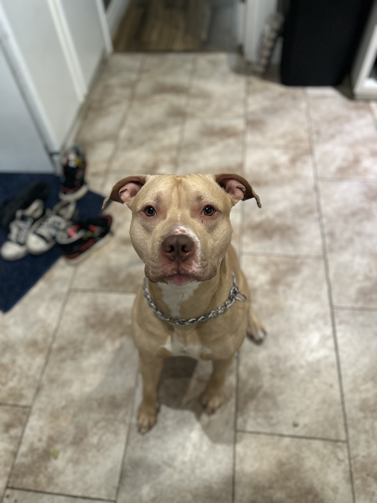

Hello all!

My name is Joshua Winters-Brown! I am a IT Expert specializing in Mobile Device Management tools like MECM, InTune, and Jamf. I have been working in IT since 2019 so roughly 4 to 5 years now (2023). Currently, i've been studying to take the CCNA, and Net+. I have been doing fairly well on my studying and am hoping to get the Net+ sometime before the end of 2024.

## Work and Hobbies

 
I am also a self taught software developer and have made so far many different applications. Currently I would like to say that I am taking liking to rust, and have been studying the language for around one year or so (since 2022). Before rust, I did mostly everything in javascript with node.js but came to really dislike the async and promises the program provided. At this point in my journey I feel relatively confident with rust and have been so far been able to really apply my knowledge and build a few applications using it. Besides rust, some of the languages I know are as follows:

| Language | Expertise Level |
| -------- | --------------- |
| Rust | Intermediate |
| Javascript | Intermediate |
| Java | Intermediate |
| C/CPP | Beginner |

When i'm not developing, or working, I am mostly outside enjoying time with family or friends or my dog. For those who are interested, heres a photo of my dog, [Oso](https://www.spanishdict.com/translate/Oso)

### Books

I also occasionally read, Im a big fan of horror. Not just horror books. But horror everything. I typically really enjoy foreign horror. So far some of my favorite books have been,

#### Favorite Books

A good book is a good book. Here I mostly read Manga, Horror Books, or Non fiction books or papers about whatever i'm interested in right now. Ill leave my top four books here for you all. These are mostly Manga, but there is at one book with words :). For Non fiction books, I typically am reading something about political theory, or about history. I am open to recommendation's, but I may not stick with it.

- [Uzumaki, by Junji Ito](https://www.goodreads.com/book/show/22400695-uzumaki-vol-6?from_search=true&from_srp=true&qid=Lm2teT343Y&rank=9)
- [Black Paradox, by Junji Ito](https://www.goodreads.com/book/show/34235163-black-paradox?ref=nav_sb_ss_1_14)
- [You've Lost a Lot of Blood, by Eric LaRocca](https://www.goodreads.com/book/show/60585628-you-ve-lost-a-lot-of-blood)
- [No Longer Human, by Dazai Osamu](https://www.goodreads.com/book/show/194746.No_Longer_Human)

#### Currently Reading

- [Zapata Of Mexico](https://www.goodreads.com/book/show/59523.Zapata_Of_Mexico)

### Movies

Im a pretty big fan of horror, so a lot of the movies and content I watch will be horror. I will also say, that I don't watch too many movies; and I watch even less TV Shows, so this list may not be updated as often.

#### Watchlist

- [Talk to Me](https://www.imdb.com/title/tt10638522/?ref_=nv_sr_srsg_0_tt_8_nm_0_q_Talk%2520to%2520me)
- [Insidious: The Red Door](https://www.imdb.com/title/tt13405778/?ref_=nv_sr_srsg_0_tt_8_nm_0_q_Insidio)

#### Current Favorites

- [They Cloned Tyrone](https://www.imdb.com/title/tt9873892/?ref_=nv_sr_srsg_0_tt_8_nm_0_q_They%2520Clon)
- [The Blackening](https://www.imdb.com/title/tt11703244/?ref_=tt_tpks_tt_t_1_pd_detail_2_pbr_ic)

### TV Shows

There are too many TV Shows too keep track of. Here are what i am currently watching :)

- [The Marked Heart](https://www.imdb.com/title/tt18974572/?ref_=fn_al_tt_2)
- [The Walking Dead City](https://www.imdb.com/title/tt18546730/?ref_=nv_sr_srsg_3_tt_8_nm_0_q_Walking%2520Dead)
- [The Walking Dead (ReWatching)](https://www.imdb.com/title/tt1520211/?ref_=nv_sr_srsg_0_tt_8_nm_0_q_The%2520Walking)
