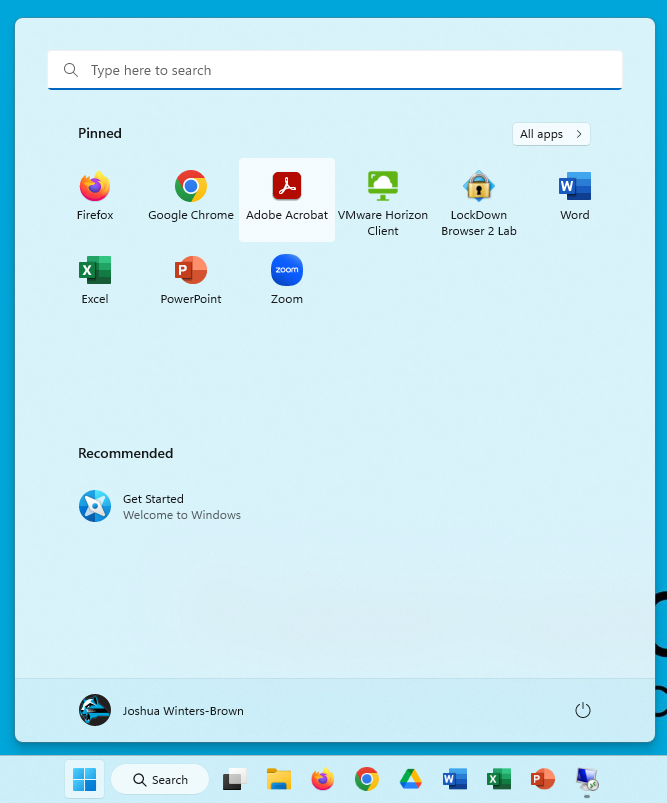

Windows 11 and Start Menus *suck.* Nothing works the way Microsoft says it should unless you use Intune. So to get around it, we just copy the bin. For now I'm doing both, considering sometime in the future Microsoft might get its stuff together and allow the JSON file to work.



## Creating a new Layout

1. On a build PC configure your new layout.
2. run the ```Export-StartLayout``` command.
3. Modify the `StartLayout` file and change the `pinnedList` to `primaryOEMPins`
4. Copy the JSON file to `C:\Users\Default\AppData\Local\Microsof\Windows\Shell`

Alternatively, windows holds an encrypted version of the startup file in the `%LocalAppData%\Packages\Microsoft.Windows.StartMenuExperienceHost_cw5n1h2txyewy\LocalState` folder. Copying the `start.bin` file to whatever computers same folder, will essentially do the same thing.

I've also created a mini program that you can use to quickly do the above commands to quickly reproduce the steps above. I will put the latest version of the source blow, alternatively you can check my Github repository out here [https://github.com/ofgrenudo/confs/tree/main/scripts/windows/start-layouts](https://github.com/ofgrenudo/confs/tree/main/scripts/windows/start-layouts)

Install.bat

```bash
cmd /c copy LayoutModification.json C:\Users\Default\appdata\local\Microsoft\Windows\Shell\LayoutModification.json /y 
cmd /c copy start.bin C:\Users\Default\AppData\Local\Packages\Microsoft.Windows.StartMenuExperienceHost_cw5n1h2txyewy\LocalState
```


do-it-again.bat

```bash
@echo off
powershell.exe Invoke-Command -scriptbloc {"Export-StartLayout -Path LayoutModifications.json"}
cmd /c copy %LocalAppdata%\Packages\Microsoft.Windows.StartMenuExperienceHost_cw5n1h2txyewy\LocalState\start.bin start.bin /y
cmd /c copy %LocalAppdata%\Packages\Microsoft.Windows.StartMenuExperienceHost_cw5n1h2txyewy\LocalState\start2.bin start.bin /y
cls
Echo Remember to Update pinnedList to primaryOEMPins
pause
```
