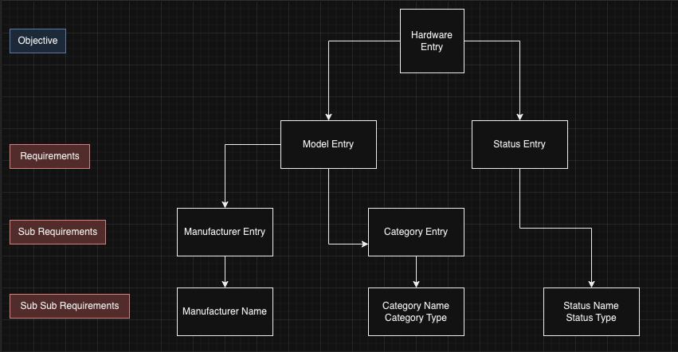

Asset Inventory Management systems present challenges for many organizations. The daily task of managing, finding, and tracking devices can be time-consuming. Various ideas emerge to simplify device tracking, such as naming devices after their serial numbers. However, this approach often provides limited insight in case of issues.

Consider the alternative of assigning meaningful names like `BLD-FLASTNAME01` or `lastname01`—common practices to enhance clarity. Yet, challenges arise when dealing with staff changes or shared devices. Renaming devices becomes a necessity, and the process of re-imaging and renaming raises questions about efficiency.

Implementing an asset inventory system is the logical next step. But what's the right approach? Perhaps hosting a solution externally? The basic requirements seem straightforward: Device Name, Manufacturer, Model Name, Model Number, Serial Number, Asset Tag, Assigned Staff, and maybe the date of imaging. A SQL server could handle this, right? A simple C or C# program could populate rows for each imaged device.

However, the simplicity fades when colleagues without SQL skills request reports. Running reports becomes a frequent task, and the SQL server database becomes impractical.

Exploring solutions, one might encounter tools like [Snipe-IT](https://snipeitapp.com/?ref=https://unorthodoxdev.net/), which ticks all the essential boxes. It provides access for non-SQL users but relinquishes some control over the database. The relational database structure, as highlighted in [this discussion](https://news.ycombinator.com/item?id=5696451), adds complexity. Navigating the [Snipe API documentation](https://snipe-it.readme.io/reference/api-overview) reveals that simplicity is elusive.

## Unraveling Complexity with a Graph

Adding a hardware entry involves creating a status entry, which requires a Status Name and a Status Type. To create a Model Entry, one needs a Category Entry and a Manufacturer Entry, each with its own set of requirements. While seemingly convoluted, this structure addresses an important issue: human error.

The challenge of discrepancies due to typos or variations in entries—whether in spreadsheets, SQL databases, or Snipe-IT—becomes evident. Using relational databases, where entries are referenced by ID rather than name, minimizes type 0 errors.

What initially seemed like a quick and easy solution now demands effort to automate device information entry into Snipe. The transition from manual entries to relational databases may pose challenges, but it ultimately addresses issues of consistency and accuracy in asset inventory management.
