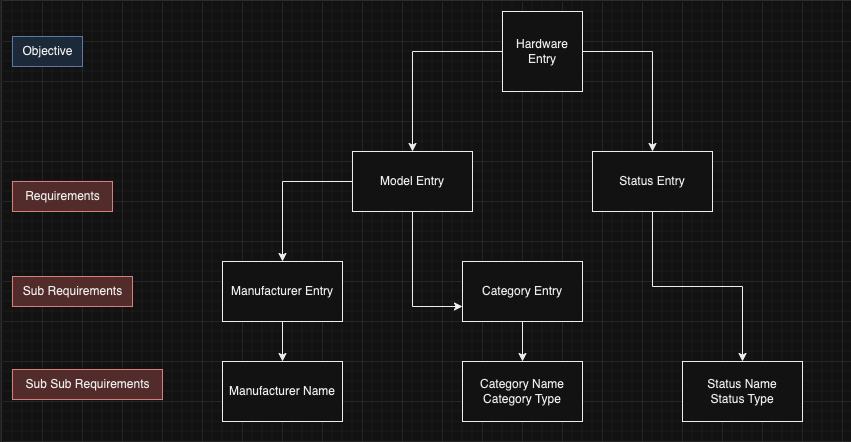

Asset Inventory Management systems are a major pain in the butt for many organizations. I spend quite a bit of time managing, finding, and hunting down devices all day. People come up with millions of ideas to try and simplify the way that we keep track of these devices. One example of this could be the name of the device.

How many of you work at a place where you name the device its serial number? Not many? Why is that? Is that because if the device all of a sudden began acting erratically a random assortment of letters and numbers dosing the active directory server gives you absolutely 0 insight other than maybe the type of device thats compromised if you can search it up via the manufacturer website.

How many of you work at a place that name your devices something meaningful? A common one is something along the lines of `BLD-FLASTNAME01`. Ive even seen just `lastname01` or `BLD-OFFICENUMB`.

What happens when someone quits, or you have part time staff sharing a computer, or a hotel desk? What do you name it then? And when someone quits, and when someone changes positions? Do you just re-image the computer change the name then? Id like to say that most of us *should*.

Ok your right, lets get an asset inventory system going. Im gonna put every device that comes in, into this .xlsx file on the network drive with out backups, or shadow copys and we will use that as our inventory system. Whats that? the building lost power last night and corrupted the file system? The inventory spreadsheets lost?

I think you get my point. Ok lets do this thing right now, we either pay for someone else to host our solution. Realistically what do we need?

- Device Name
- Manufacturer
- Model Name
- Model Number
- Serial Number
- Asset Tag
- Assigned Staff
- Maybe the date it was Imaged

Those aren't too many requirements right? No reason we couldn't just throw up some kind of sql server right? Im sure I could write some kind of quick c or c# program to throw in a row every time we image a device.

Ohhhhhhhhh, my peers want access to pull reports now, and you know what. They don't know sql. So they ask me to run a report all the time, what device is this, what device is that? Very quickly that little sql server database became defunct about as soon as it went up.

Okay fine, I could build an interface for it. Buttttttt thats too much work. Someone else in the world has ran into the same issue as me right? Probably.....

What solutions exist out there today? Well the one that I fell on was [Snipe-IT](https://snipeitapp.com/?ref=https://unorthodoxdev.net/). Without going into everything, it meets all of the above check boxes, and I can give access to people who don't have sql skills. Only problem is, now I don't have complete control over the database, and they've got some [relational database gunk](https://news.ycombinator.com/item?id=5696451) (warning hacker news is cancer i'm sorry.). Ok lets go to the [api docs](https://www.youtube.com/watch?v=7iDfvoqOhD8) [for snipe](https://snipe-it.readme.io/reference/api-overview).

> Wait. Its actually good?

Oh it must be so easy to use the API then!

Wrong :\

## Time for Graph :0

All you want to do is add a hardware entry? Oh ok sure, you need to make a status entry. But to make a status entry you need a Status Name, and a Status Type. Oh anddd you'll need a Model Entry, but to make a Model Entry you need a Category Entry and a Manufacturer Entry. Don't worry though the Category Entry only needs a Category Name and Category Type. The Manufacturer Entry only needs the Manufacturer Name.

All of this makes sense, right? These are requirements I technically already had. The only difference is that with Snipe-IT they are using a relational database where the model entry calls on the manufacturer entry via an ID and the category entry by an ID which are the primary key of that table.

Doing this solves an issue that we have not talked about yet. Remember that spreadsheet we had, or even that sql database I setup? We did not account for human error. What happens if Joe from the depths of the IT basement office decides to add the device his boss ordered him to setup to the database and decides to put `Dell` and not `dell` like i've been putting? Well, when I get asked to pull a report for all devices named `dell` Joe's entry doesn't turn up because the manufacturer entry has a discrepancy in it. This kind of issue isn't a sql database issue alone its a xlsx sheet database issue and its a Snipe-IT issue.

So how do we combat this? relational databases. You create one entry, and reference it via its id not its name. Cuts down on type 0 errors.

Something that was quick and easy just became a massive pain in the but to work with. Now i've got to some work to do in regards to getting devices to automatically fill information into snipe.
